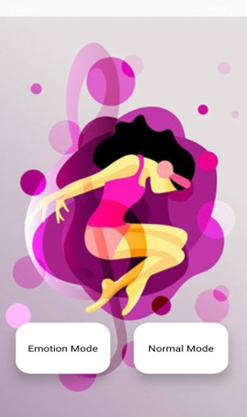
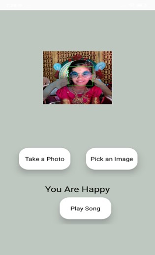
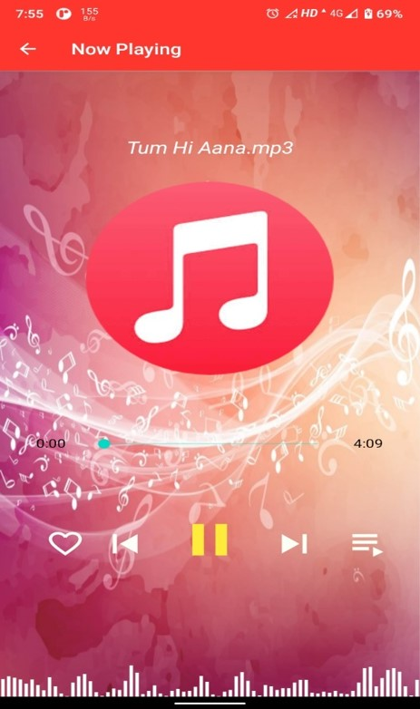
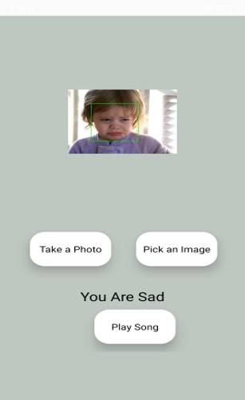
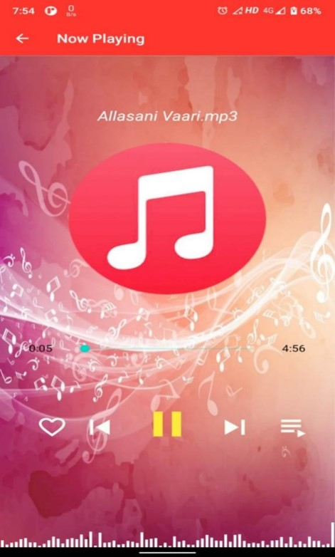
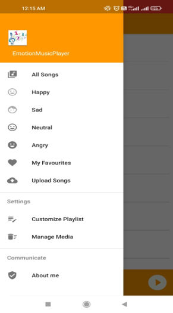
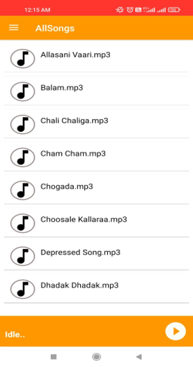

# Emotion Based Music Player

## This is Android App which uses capability of humans to express emotions through facial expressions to detect and suggest emotion based music of the end user.

  
  

  
  

  
  

  
  

  
Please Try the App and let me know for any Suggestions or Bugs ..

  <a href="https://drive.google.com/file/d/19QvdSCaeKJAO7k-tRlrnRu7hPYhEy5VT/view?usp=sharing" target="_new">Click Here to Download</a>

  
